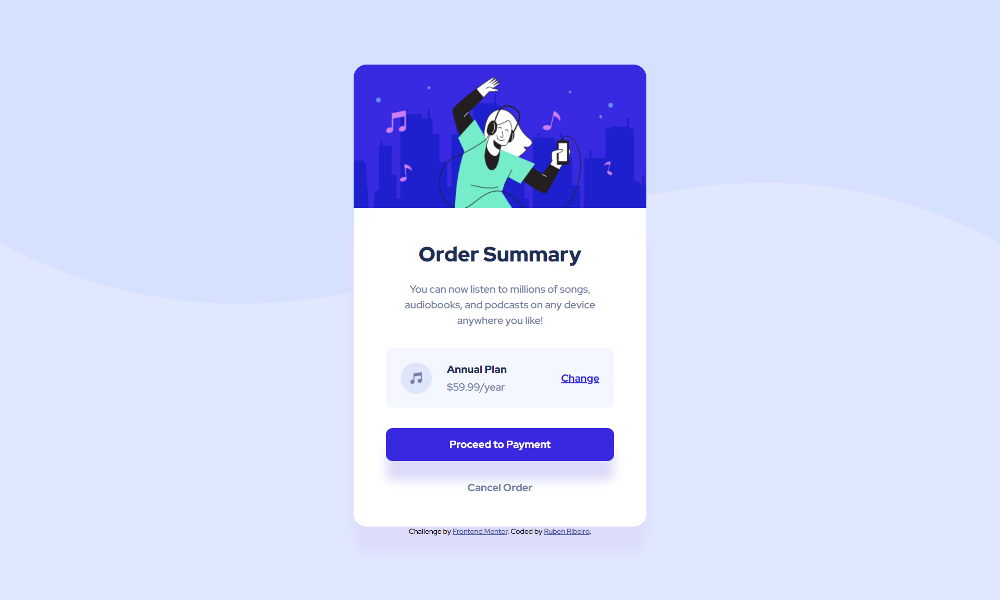

# Frontend Mentor - Order summary card solution

This is a solution to the [Order summary card challenge on Frontend Mentor](https://www.frontendmentor.io/challenges/order-summary-component-QlPmajDUj). Frontend Mentor challenges help you improve your coding skills by building realistic projects. 

## Table of contents

- [Overview](#overview)
  - [The challenge](#the-challenge)
  - [Screenshots](#screenshots)
  - [Links](#links)
- [My process](#my-process)
  - [Built with](#built-with)
  - [What I learned](#what-i-learned)
  - [Continued development](#continued-development)
  - [Useful resources](#useful-resources)
- [Author](#author)
- [Acknowledgments](#acknowledgments)

## Overview

### The challenge

Users should be able to:

- See hover states for interactive elements

### Screenshots




### Links

- Solution URL: [https://github.com/RubenRibeiro13/order-summary-card](https://github.com/RubenRibeiro13/order-summary-card)
- Live Site URL: [https://rubenribeiro13.github.io/order-summary-card](https://rubenribeiro13.github.io/order-summary-card)

## My process

### Built with

- Semantic HTML5 markup
- CSS custom properties
- Flexbox

### What I learned

While working through this project, I learned the basics of HTML sectioning elements, flexbox and media queries, what a mobile-first responsive design is, and how to set background images and add shadow effects.

```html

<nav>
  <a class="btn" href="#">Proceed to Payment</a>
  <a class="option-2" href="#">Cancel Order</a>
</nav>

```

```css

.container {
  display: flex;
  flex-flow: row nowrap;
  justify-content: space-between;
  align-items: center;
}

body {
  margin: 0;

  background-color: hsl(225, 100%, 94%);
  background-image: url("images/pattern-background-mobile.png");
  background-repeat: no-repeat;
  background-size: 100% auto;

  text-align: center;
  font-family: 'Red Hat Display', sans-serif;
}


@media screen and (min-width: 900px) {

  body {
    background-image: url("images/pattern-background-desktop.png");
  }

}


.main-div {
  width: 87%;
  max-width: 450px;
  margin: 0 auto;
}

.white-bg {
  background-color: white;

  width: 100%;
  padding: 11% 0;

  border-radius: 0 0 20px 20px;
  box-shadow: 0 40px 15px #d3d3d3;
}

```

### Continued development

In future projects, I want to continue focusing on HTML sectioning elements, flexbox and media queries. I also want to start learning the basics of CSS Grid.

### Useful resources

- [CSS-Tricks](https://css-tricks.com) - This resource helped me understand more about HTML sectioning elements and flexbox.
- [W3Schools Online Web Tutorials](https://www.w3schools.com) - This resource gave me an idea of which breakpoints to use in media queries.
- [MDN Web Docs](https://developer.mozilla.org) - This is my go-to resource when I need to use a property for the first time, such as background-image or box-shadow.

## Author

- Website - [Ruben Ribeiro](https://rubenribeiro13.github.io/my-site)
- Frontend Mentor - [@RubenRibeiro13](https://www.frontendmentor.io/profile/RubenRibeiro13)

## Acknowledgments

I'd like to thank one of my best friends, João Gonzalez, for introducing me to the flexbox module.
